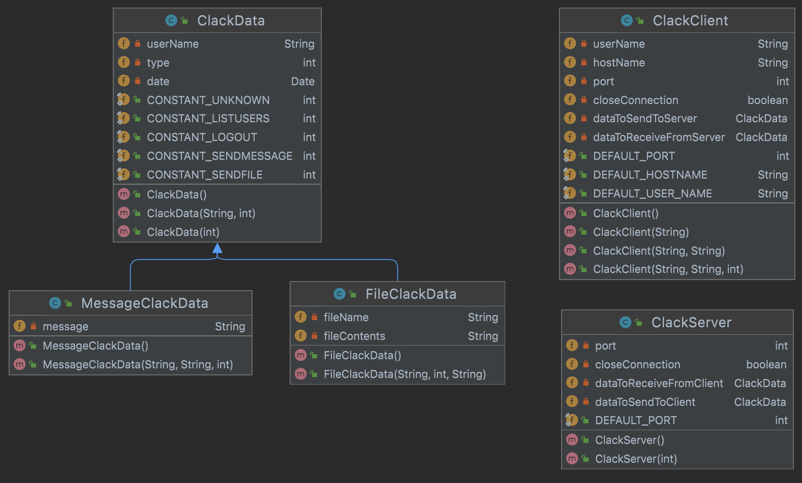

# Clack
Clack _(Clarkson Slack)_ project for CS-242.

By Humaira Rezaie and Christopher Mahoney.

## Part 2
###TODO list:
- [x] Encryption and decryption methods
- [ ] Implementation of new constructor in MessageClackData
- [ ] Implementation of overloaded method getData in two MessageClackData and FileClackData classes
- [ ] Implementation of overloaded methods readFileContents and writeFileContents in FileClackData
- [ ] New functionality in ClackClient
- [ ] Correctly written and running TestClackData
- [ ] Correctly written and running TestClackClient
- [ ] Report with output from TestClackClient
- [ ] Javadoc comments, and Javadoc folder
- [ ] Contributions reports

## Part 1
###TODO list:
- [x] Git practice
- [x] Correctly written ClackData
- [x] Correctly written FileClackData
- [x] Correctly written MessageClackData
- [x] Correctly written ClackServer 
- [x] Correctly written ClackClient
- [x] Correctly written and running TestClackData
- [x] Correctly written and running TestClackServer
- [x] Correctly written and running TestClackClient
- [x] Javadoc comments, and Javadoc folder
- [x] Report with all questions answered
- [x] Contributions reports
  
### Report

**Diagram:**

> In your test classes, what happens if you provide a negative value for a port
number, or a null value for a user? How do you think you can fix these issues?

There is nothing that immediately breaks when inserting these edge case into our classes. 
However, as the project progresses and more things start functioning we would start running into issues.
For example a negative value for a port would crash our program because ports must be between 1 and 65535.
If we asked the operating system for port `-30` it would likely just refuse our request or if 
for some reason it did allocate a port it would be something unexpected.

A bad solution is to "just write good code" and "trust the user". These solutions won't work in a production 
environment. A general solution to all of these types of problems is to check for these edge cases and raise exceptions
whenever they are reached.